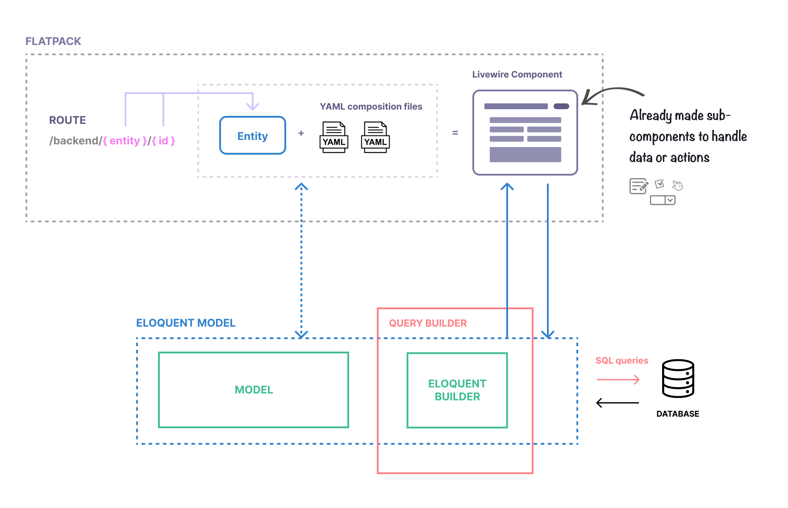

# How it works

Flatpack helps you to quickly create Forms and Table (Lists) components that are mapped to an [Eloquent](https://laravel.com/docs/8.x/eloquent) model instance. It identifies the current model based on the `{entity}` route parameter.



## Example

The route `/backend/posts/` (parametrized as `/backend/{entity}/`) will show a Table component that automatically generates queries using the `App\Models\Post` model query builder (using rappasoft's [Livewire Tables](https://github.com/rappasoft/laravel-livewire-tables) under the hood).

The route `/backend/posts/42` (parametrized as `/backend/{entity}/{id}`) will automatically map the current entity to an instance of `App\Models\Post` with the id `42`.

YAML files define how a Form (or Table) component should look like, by mapping each form field (or table column) to a model's attribute.

```yaml
# /flatpack/posts/form.yaml

fields:
  title:
    type: text
    label: Title
    placeholder: Enter a title
```

The field `title` above is rendered as a `text` input, which is binded to the `title` attribute of the current instance of `Post` (e.g. `$post->title`).


